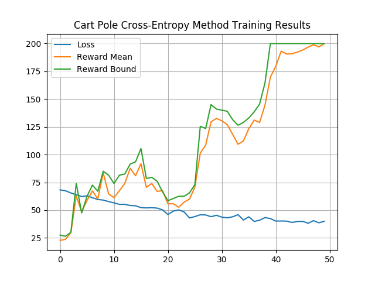

# Deep Reinforcement Learning with PyTorch
Working through Maxim Lapan's Book "Deep Reinforcement Learning Hands-On".

## Sections
I. [Cross-Entropy Method](https://github.com/ElliotVilhelm/Deep-Reinforcement-Learning#cross-entropy-method)

&nbsp;&nbsp;&nbsp;&nbsp;A.[Cart Pole](https://github.com/ElliotVilhelm/Deep-Reinforcement-Learning#cross-entropy-method)

II. Deep Q Networks

## Cross Entropy Method
### CartPole
#### Execution
```
python3 -m CrossEntropyMethod.cart_pole
```


#### Reasoning
- Simplicity
- Good Convergence in simple environments

#### Strategy
Our cross-entropy method is policy-based. Our nonlinear function (neural network) produces a policy which determines
for every observation which action the agent should take. The output of our network will be a probability distribution
over actions. Notice, this is very similar to a classification problem in which we assign a probability to each class.
Rather, the number of classes we have is the number of actions we are able to take. Thus, our process is as follows:

1. Input a observation to the network
2. Network outputs a probability distribution over actions
3. Perform random sampling over probability distribution

Our training process is conducted as follows:

1. Play N number of episodes using the current model and environment
2. Calculate the total reward for every episode and decide on a reward boundary. Usually, we use some percentile of
all rewards, such as 50th or 70th.
3. Throw away all episodes with a reward below the boundary.
4. Train network on the remaining "elite" episodes using observations as the input
and issued actions as the desired output.
5. Repeat from step 1 until we are satisfied with the result.

You may be wondering how we calculate loss. The targets of out networks output
are determined by the actions taken in the "elite" episodes. We are essentially teaching
the network to replicate the behavior within these "elite" episodes, as we repeat this processes
our "elite" episodes grow better and better, as does our network.

#### Architecture and Hyperparameters
- Number of Layers: 1

- Number of Hidden Units Per Layer: 128

- Activation Function: ReLU

- Optimizer: Adam

- Learning Rate: 0.01


#### Results
The network was able to converge in 50 iterations with a batch size of 16.



Note, Loss has been scaled by a factor of 100 in the figure above.

#### Output
```
0: loss=0.690, reward_mean=19.2, reward_bound=23.5
1: loss=0.691, reward_mean=25.4, reward_bound=29.0
2: loss=0.674, reward_mean=24.1, reward_bound=33.0
3: loss=0.667, reward_mean=30.2, reward_bound=32.5
4: loss=0.663, reward_mean=37.2, reward_bound=45.5
5: loss=0.635, reward_mean=37.0, reward_bound=47.0
6: loss=0.631, reward_mean=55.4, reward_bound=61.0
7: loss=0.633, reward_mean=44.2, reward_bound=41.5
8: loss=0.613, reward_mean=42.1, reward_bound=48.5
9: loss=0.598, reward_mean=45.2, reward_bound=52.0
10: loss=0.617, reward_mean=44.2, reward_bound=51.5
11: loss=0.589, reward_mean=69.4, reward_bound=88.5
12: loss=0.583, reward_mean=54.0, reward_bound=65.5
13: loss=0.576, reward_mean=67.9, reward_bound=76.5
14: loss=0.582, reward_mean=72.1, reward_bound=84.0
15: loss=0.571, reward_mean=60.6, reward_bound=68.0
16: loss=0.580, reward_mean=72.9, reward_bound=82.5
17: loss=0.566, reward_mean=73.5, reward_bound=89.0
18: loss=0.544, reward_mean=78.4, reward_bound=91.5
19: loss=0.549, reward_mean=89.8, reward_bound=99.0
20: loss=0.579, reward_mean=76.4, reward_bound=84.5
21: loss=0.536, reward_mean=97.0, reward_bound=115.0
22: loss=0.568, reward_mean=78.4, reward_bound=95.5
23: loss=0.540, reward_mean=82.6, reward_bound=95.5
24: loss=0.562, reward_mean=107.1, reward_bound=126.5
25: loss=0.541, reward_mean=94.3, reward_bound=111.0
26: loss=0.580, reward_mean=94.2, reward_bound=111.5
27: loss=0.520, reward_mean=106.2, reward_bound=117.0
28: loss=0.549, reward_mean=93.6, reward_bound=112.5
29: loss=0.548, reward_mean=95.9, reward_bound=121.5
30: loss=0.553, reward_mean=102.1, reward_bound=125.0
31: loss=0.535, reward_mean=125.6, reward_bound=156.0
32: loss=0.527, reward_mean=137.8, reward_bound=168.0
33: loss=0.544, reward_mean=132.8, reward_bound=159.0
34: loss=0.573, reward_mean=155.2, reward_bound=182.5
35: loss=0.539, reward_mean=172.9, reward_bound=200.0
36: loss=0.549, reward_mean=187.8, reward_bound=200.0
37: loss=0.548, reward_mean=191.0, reward_bound=200.0
38: loss=0.552, reward_mean=193.4, reward_bound=200.0
39: loss=0.545, reward_mean=198.9, reward_bound=200.0
40: loss=0.536, reward_mean=194.6, reward_bound=200.0
41: loss=0.546, reward_mean=177.4, reward_bound=200.0
42: loss=0.540, reward_mean=200.0, reward_bound=200.0
Solved!
```

